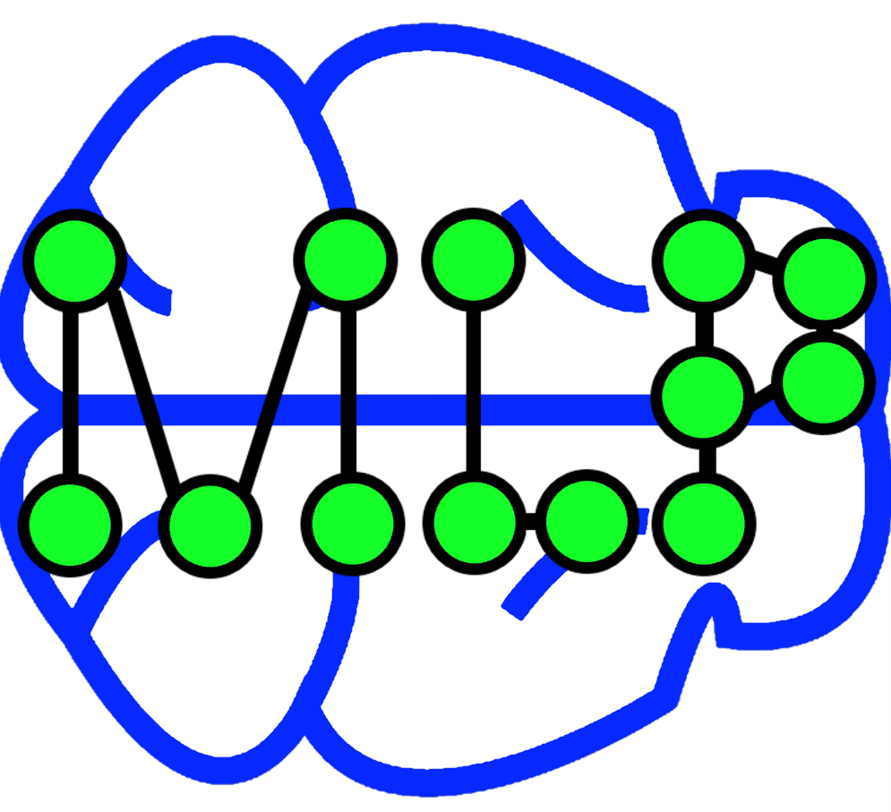

# MLP
## About

MLP stands for [multilayer perceptron](https://en.wikipedia.org/wiki/Multilayer_perceptron).
This project is a simple & fast C++ implementation of a MLP, oriented towards hacking and rapid prototyping.
It is well-tested and includes multiple tests for each component as well as use cases.

This project is maintained by [David Nogueira](http://web.tecnico.ulisboa.pt/david.jacome.nogueira/).


## Featuring

- C++ implementation.
- Modular-oriented, with classes built on top of each other: Node, Layer and network classes.
- Easy to use and to hack.
- Simple, fast and thread-safe.
- Tests for each component module as well as use-case tests.
- Supports saving & loading models.

## OS Support

MLP offers support both for Windows (MVS) & Linux (g++/clang++).

## Tests/Example Code

Some example programs are included with the source code.

- [`IrisDatasetTest.cpp`](./src/IrisDatasetTest.cpp) - Using the [IRIS data-set](https://archive.ics.uci.edu/ml/datasets/Iris) trains a MLP using backpropagation and tries to predict the classes.
- [`MLPTest.cpp`](./src/MLPTest.cpp) - Includes tests to train a MLP for AND, NAND, NOR, OR, NOT and XOR using backpropagation.
- [`NodeTest.cpp`](./src/NodeTest.cpp) - Includes tests to train a single node (aka, perceptron) for AND, NAND, NOR, OR, NOT and XOR using backpropagation. (*A simple perceptron cannot learn the XOR function.*)

## Example

Let us look at an example. After loading the data and creating the training/dev/test data structures, we will create a MLP with input size 5 (assuming 4 input data features + 1 bias), a hidden layer of 4 neuros and an output layer with 3 outputs (3 possible predicted classes). The activation functions will be a sigmoid for the hidden layer and a linear one for the output layer.

```cpp
#include "MLP.h"
#include <vector>

// ...
std::vector<TrainingSample> training_set;
// ...

// assuming 4 inputs + 1 bias.
// 1 hidden layer(s) of 4 neurons.
// assuming 3 outputs
MLP my_mlp({ 4 + 1, 4 , 3 }, { "sigmoid", "linear" }, false);

int loops = 5000;
my_mlp.Train(training_set, .01, loops, 0.10, false);

int correct = 0;
for (int j = 0; j < samples; ++j) {
  std::vector<double> guess;
  my_mlp.GetOutput(training_set[j].input_vector(), &guess);
  size_t class_id;
  my_mlp.GetOutputClass(guess, &class_id);

  // Compare class_id with gold class id for each instance
}
```

Saving and loading models is also very intuitive:

```cpp
#include "MLP.h"
{
  std::string model = "../../data/iris.mlp";
  //...
  my_mlp.SaveMLPNetwork(model); //saving
}
{
  MLP my_mlp(model); //load a model in constructor
  //...
}
```
